## Hello! I'm Najla

I'm a university student building my skills in **data analysis, data science, and AI**. I like turning raw data into clear answers, and I'm learning in public on GitHub.

## 🌱 Currently learning 

- Python and SQL for data
- Data analysis with Excel, pandas, and Power BI
- Machine learning fundamentals

I'm following my own [Data & AI Roadmap](https://datascientist0.github.io/Data-Ai-roadmap/), a living roadmap that I keep updating as I learn.

## 🛠️ Skills

**💻 Programming languages**

**📊 Data analysis & visualization**

**🤖 Data science & AI**

## 🧰 Tools

**Databases**

**Coding environments**

**Platforms & version control**

**AI assistants**

## 📂 Projects

| Project | Description |
|---|---|
| [Data & AI Roadmap](https://github.com/DataScientist0/Data-Ai-roadmap) | An interactive 3-month roadmap for students getting into data analysis, data science, and AI. Updated regularly with new topics and resources. [Live page](https://datascientist0.github.io/Data-Ai-roadmap/) |
| [learn-git-with-pathy](https://github.com/DataScientist0/learn-git-with-pathy) | My notes from learning Git and GitHub basics |

More projects coming soon as I work through my roadmap.

## 📫 Connect with me

